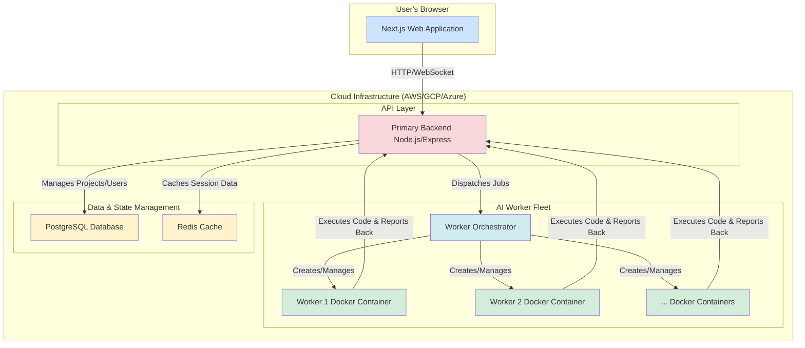

# Bolt AI: Your AI-Powered Development Environment

[](https://opensource.org/licenses/MIT)

Bolt AI is a comprehensive, AI-driven development platform designed to accelerate your coding workflow. It provides a seamless, web-based environment where you can generate, edit, and execute code using the power of artificial intelligence. This project is built on a robust, scalable microservices architecture, making it a perfect showcase of modern AI infrastructure and systems engineering.

## Overview

At its core, Bolt AI provides a dynamic, isolated environment for every user. When a user starts a session, a dedicated "worker" (a Docker container) is spun up, providing a secure and sandboxed space for code execution. The user interacts with the system through a sleek Next.js frontend, which communicates with a primary backend to manage projects, users, and AI-driven actions.

The magic happens in the `worker` service, which takes prompts from the user, and with the help of a sophisticated system prompt, generates code, and executes commands. This allows for rapid prototyping and development, all within a web browser.

## System Architecture

Bolt is designed as a distributed system with several key components working in concert. This architecture ensures scalability, fault tolerance, and a clean separation of concerns.



### Components

-   **`apps/frontend`**: A Next.js application that serves as the user interface. It provides a rich, interactive experience for managing projects and interacting with the AI.
-   **`apps/primary-backend`**: The central nervous system of the platform. This Node.js/Express server handles user authentication, project management, and communication with the worker services.
-   **`apps/worker`**: The heart of the AI's code generation and execution capabilities. Each worker is a sandboxed Docker container that runs a Node.js environment. It receives prompts, generates code via an AI model, and executes it.
-   **`apps/worker-orchestrator`**: This service is responsible for managing the lifecycle of the worker containers. It spins up new workers for new user sessions and scales the worker fleet based on demand.
-   **`packages/db`**: Contains the Prisma schema and client for the PostgreSQL database. It manages the data models for Users, Projects, and Prompts.
-   **`packages/redis`**: A shared Redis client for caching and message passing between services.

## Features

-   **AI-Powered Code Generation**: Leverage the power of AI to generate code from natural language prompts.
-   **Sandboxed Execution Environments**: Each user session runs in a secure, isolated Docker container, preventing any unwanted side effects.
-   **Real-time Collaboration**: (Future) Multiple users can collaborate on the same project in real-time.
-   **Scalable Architecture**: The microservices-based architecture allows for independent scaling of each component.
-   **Modern Tech Stack**: Built with the latest and greatest technologies, including Next.js, Node.js, TypeScript, Docker, and Prisma.

## Technology Stack

-   **Monorepo:** Turborepo
-   **Frontend:** Next.js, React, TypeScript, Tailwind CSS
-   **Backend:** Node.js, Express
-   **Database:** PostgreSQL with Prisma
-   **Caching:** Redis
-   **Containerization:** Docker
-   **Linting & Formatting:** ESLint, Prettier

## Project Structure

The project is organized as a Turborepo monorepo:

```
bolt-mobile-app/
├── apps/
│   ├── frontend/         # Next.js web application
│   ├── primary-backend/  # Main backend server
│   ├── worker/           # AI code execution worker
│   └── worker-orchestrator/ # Manages the worker fleet
├── packages/
│   ├── db/               # Database schema and client
│   ├── eslint-config/    # Shared ESLint configurations
│   ├── redis/            # Shared Redis client
│   └── typescript-config/ # Shared TypeScript configurations
└── package.json
```

## Getting Started

To get the project up and running, follow these steps:

1.  **Clone the repository:**
    ```bash
    git clone <your-repo-url>
    cd bolt-mobile-app
    ```

2.  **Install dependencies:**
    ```bash
    bun install
    ```

3.  **Set up environment variables:**
    Create a `.env` file in the root of the project and add the necessary environment variables (e.g., database connection string, JWT secret).

4.  **Run the development servers:**
    ```bash
    bun dev
    ```
    This will start all the applications in the monorepo.

## License

This project is licensed under the MIT License. See the [LICENSE](LICENSE) file for details.